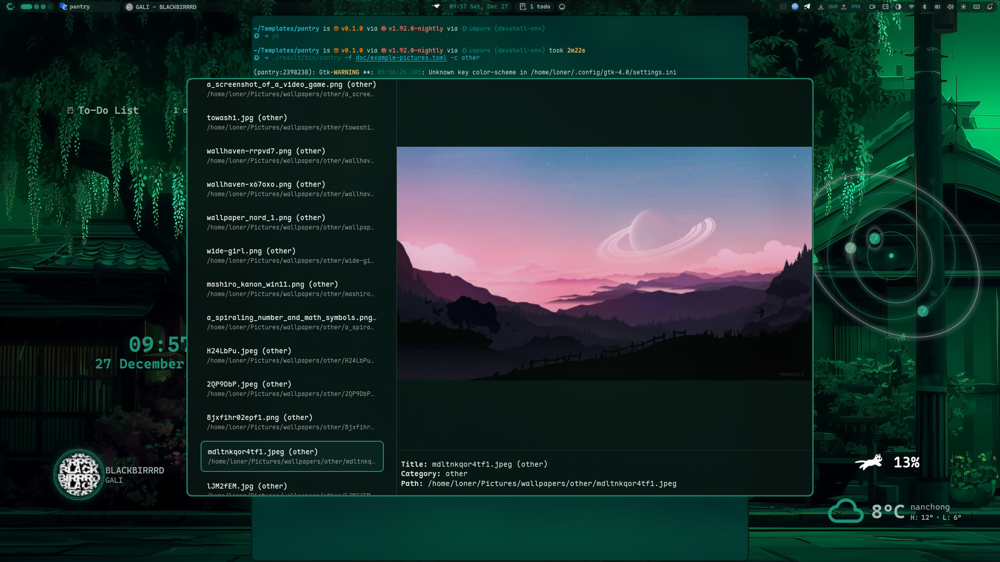

# pantry - Generic Selector

A generic selector tool for handling various types of entries with text and image preview modes.



## Description

pantry is a GTK4-based graphical interface tool for managing and selecting various types of entries such as bookmarks, commands, and images. It reads data from TOML configuration files and provides search and filtering capabilities, supporting both text and image preview modes.

## Features

- Support for text and image preview modes
- Search and filtering functionality
- Responsive user interface
- Image preview and detailed information display
- Configuration file-driven data management
- Output piping for integration with other tools

## Installation

### 1. Build from source

```bash
git clone https://github.com/lonerOrz/pantry.git
cd pantry
cargo build --release
```

### 2. Install via Nix (for Nix or NixOS users)

```bash
{
  inputs = {
    nixpkgs.url = "github:nixos/nixpkgs/nixos-unstable";
    flake-utils.url = "github:numtide/flake-utils";
    pantry.url = "github:lonerOrz/pantry";
  };

  outputs =
    inputs @{
      self,
      flake-utils,
      nixpkgs,
      ...
    }:
    flake-utils.lib.eachDefaultSystem (
      system:
      let
        pkgs = import nixpkgs {
          inherit system;
        };
      in
      {
        devShells.default = pkgs.mkShell {
          packages = [ inputs.pantry.packages.${system}.pantry ];
        };
      }
    );
}
```

## Usage

Basic usage:

```bash
pantry -f /path/to/config.toml
```

Specify category:

```bash
pantry -f /path/to/config.toml -c bookmarks
```

Options:

- `-f, --config`: Configuration file path (defaults to `~/.config/pantry/config.toml`)
- `-c, --category`: Specify the category to load (load only categories matching the global display mode if not specified)

## Documentation

For detailed usage instructions and examples, see our [Getting Started Guide](doc/start.md).

## Configuration

pantry uses TOML format configuration files with separate display and input modes. Each category can optionally specify its own modes, which will override the global defaults.

For detailed configuration examples, see our [Getting Started Guide](doc/start.md) and example files in the [doc](doc/) directory.

## License

BSD 3-Clause License

---

> If you find `pantry` useful, please give it a ⭐ and share! 🎉
